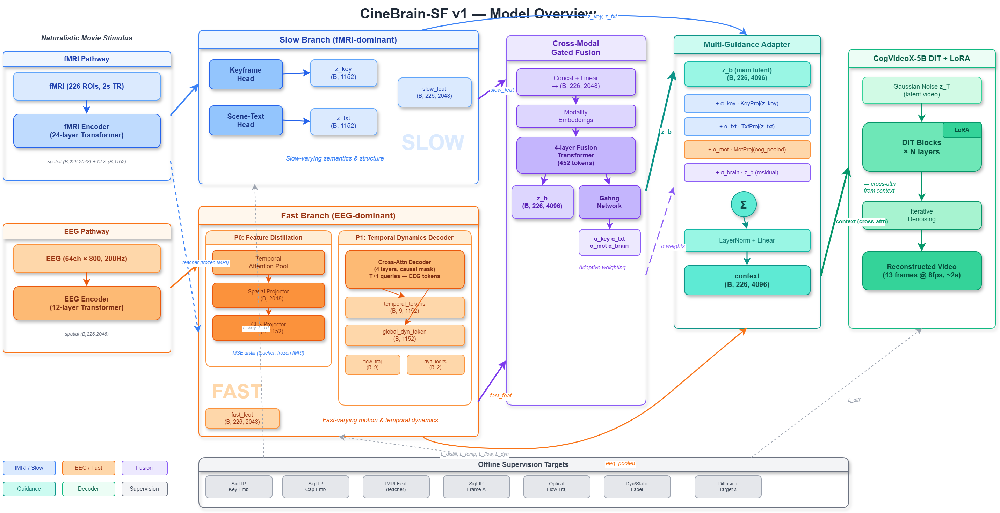

# CineBrain-SF: Slow-Fast Dual-Branch Architecture for Brain-to-Video Reconstruction

[Drift](https://github.com/HandsomeDrift)

[](#)
[](https://huggingface.co/datasets/Fudan-fMRI/CineBrain)

## Overview

Brain-to-video reconstruction aims to decode naturalistic visual perception from non-invasive neural recordings (fMRI, EEG) into video. Existing multi-modal approaches fuse fMRI and EEG into a unified brain latent, ignoring their fundamentally different strengths: fMRI captures high-resolution spatial semantics while EEG captures high-frequency temporal dynamics.

**CineBrain-SF** introduces an explicit **Slow-Fast role assignment** inspired by the ventral-dorsal visual pathway separation in neuroscience:

- **Slow Branch (fMRI-driven)**: decodes semantic content, spatial structure, and keyframe priors — *what is in the video*
- **Fast Branch (EEG-driven)**: decodes motion dynamics, temporal changes, and scene transitions — *how the video changes*

The two branches are combined through **Cross-Modal Gated Fusion** with learned per-sample guidance weights, and injected into a CogVideoX-5B video diffusion model via a **Multi-Guidance Adapter**.

## Architecture

<p align="center">
  
</p>

## Results

Within-subject evaluation on CineBrain dataset (sub-05, 540 test videos):

| Metric | CineBrain Baseline | **CineBrain-SF v2** | Change |
|--------|:--:|:--:|--------|
| **FVD** | 895.14 | **618.72** | **-30.9%** |
| **EPE** | 3.68 | **2.94** | **-20.1%** |
| SSIM | 0.288 | **0.302** | +4.9% |
| CLIP Score | 0.737 | **0.747** | +1.4% |

Cross-subject evaluation (train on sub-05, test on sub-03/04):

| Metric | CineBrain Baseline | **CineBrain-SF v2** | Change |
|--------|:--:|:--:|--------|
| **FVD** | 936.65 | **684.06** | **-27.0%** |
| **EPE** | 3.81 | **3.04** | **-20.2%** |

## Method

### Slow Branch

The fMRI encoder (24-layer Transformer) processes visual and auditory ROI signals. Three prediction heads decode:
- **Keyframe Head**: predicts SigLIP image embeddings as visual priors
- **Scene-Text Head**: predicts text description embeddings for semantic guidance
- **Structure Head**: predicts VAE latent-space spatial layout

An audiovisual context adapter fuses auditory fMRI via cross-attention for richer scene understanding.

### Fast Branch

The EEG encoder (Conv1d + TCN + 12-layer Transformer) feeds into two pathways:
- **P0 Feature Distillation**: aligns EEG features to fMRI feature space via MSE distillation
- **P1 Temporal Dynamics Decoder**: a cross-attention decoder with learnable temporal queries that extracts per-frame temporal change sequences, supervised by delta-SigLIP embeddings and flow trajectory classification

### Cross-Modal Gated Fusion

Separate projections for Slow/Fast features, combined via cross-attention mixing. A gating network learns per-sample weights for four guidance channels (keyframe, text, motion, brain latent).

### Multi-Guidance Adapter

Per-channel cross-attention injects guidance signals into the brain latent with spatial selectivity. Zero-initialized output projections ensure guidance grows from zero without disrupting the pretrained diffusion model.

### Training Pipeline

Three-stage progressive training with gradient isolation:

1. **Branch Pretrain**: train Slow and Fast branches independently with frozen DiT
2. **Fusion Training**: train Gated Fusion and Multi-Guidance Adapter with frozen branches
3. **Joint Finetuning**: end-to-end finetuning of all SF modules with LoRA on DiT

## Getting Started

This codebase is built on [CogVideoX-5B (SAT)](https://github.com/THUDM/CogVideo) with LoRA finetuning.

### Prerequisites

- GPU: NVIDIA A100/A800 80GB (1 GPU for inference, 2-4 for training)
- Python 3.10+, PyTorch 2.6+, CUDA 12.4
- Dataset: [CineBrain](https://huggingface.co/datasets/Fudan-fMRI/CineBrain)

### Installation

```bash
git clone https://github.com/HandsomeDrift/SF-v3.git
cd SF-v3
pip install -r requirements.txt
```

For detailed data preparation, model weights, and path configuration, see [REPRODUCTION.md](REPRODUCTION.md).

### Inference

```bash
CUDA_VISIBLE_DEVICES=0 python sample_brain_va.py \
  --base configs/sf_v1/cinebrain_sf_v1_model.yaml configs/sf_v1/infer_stage3_v2.yaml \
  --seed 42 \
  --jsonpath /path/to/sub-0005_test_va.json \
  --output_dir results/sf_v2_sub05
```

### Training

```bash
# 4-GPU training (Stage 3 Joint Finetuning example)
CUDA_VISIBLE_DEVICES=0,1,2,3 python -m torch.distributed.run \
  --standalone --nproc_per_node=4 \
  train_video_fmri.py \
  --base configs/sf_v1/cinebrain_sf_v1_model.yaml configs/sf_v1/sf_v1_stage3_joint.yaml \
  --seed 42
```

### Evaluation

```bash
python get_metric.py --sub 05
```

## Citation

```bibtex
@article{cinebrain-sf,
  title={CineBrain-SF: Slow-Fast Dual-Branch Architecture for Brain-to-Video Reconstruction},
  author={Drift},
  year={2026}
}
```

This work builds upon CineBrain:

```bibtex
@article{gao2025cinebrain,
  title={CineBrain: A Large-Scale Multi-Modal Brain Dataset During Naturalistic Audiovisual Narrative Processing},
  author={Gao, Jianxiong and Liu, Yichang and Yang, Baofeng and Feng, Jianfeng and Fu, Yanwei},
  journal={arXiv preprint arXiv:2503.06940},
  year={2025}
}
```

## Acknowledgements

- [CineBrain](https://github.com/yanweifu-sii/CineBrain) for the dataset and baseline codebase
- [CogVideoX](https://github.com/THUDM/CogVideo) for the video diffusion backbone
- [SAT](https://github.com/THUDM/SwissArmyTransformer) for the transformer training framework
